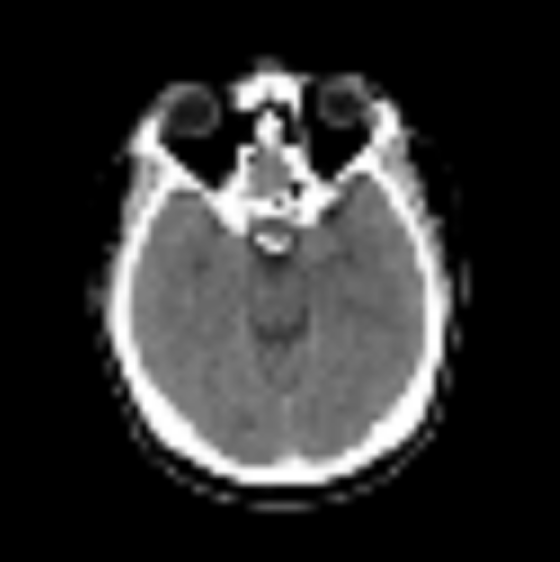
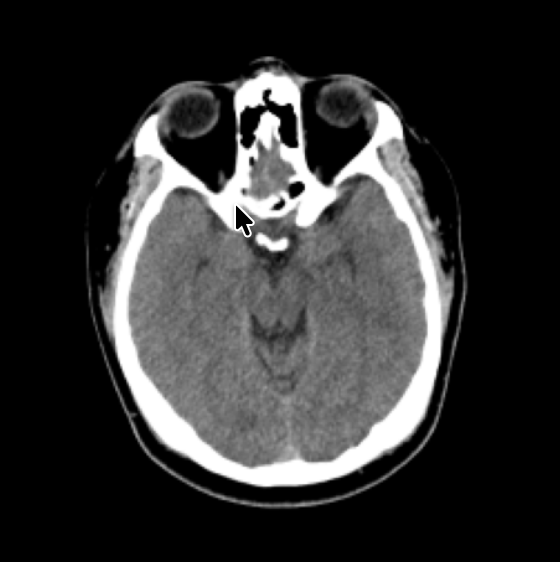
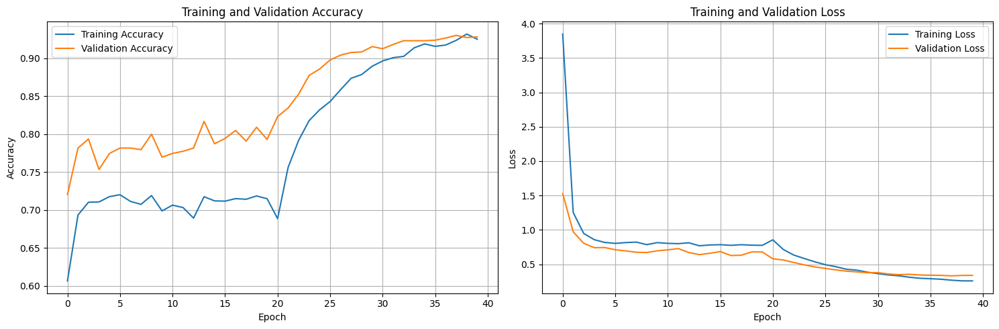
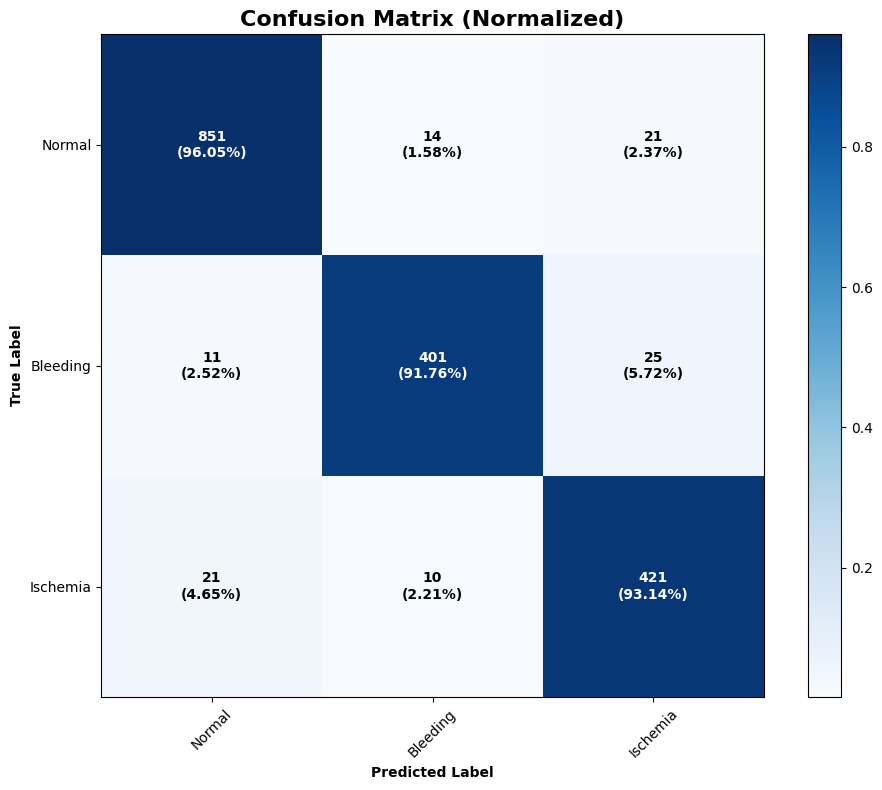

# Brain CT Reconstruction and Classification via Deep Learning

This repository contains the implementation of **Pix2CT**, a deep learning project performing two key medical imaging tasks:
1. **CT Image Reconstruction** — Enhancing low-quality or simulated images into realistic CT scans using a **Pix2Pix conditional GAN**.
2. **Brain CT Classification** — Identifying brain conditions (Normal, Bleeding, or Ischemia) using **Transfer Learning with MobileNetV2**.

---


## Installation and Setup

### 1. Clone the repository
```bash
git clone https://github.com/ahmedazhar2299/Pix2CT.git
cd Pix2CT
```

### 2. Create and activate a virtual environment (optional)
```bash
python -m venv venv
source venv/bin/activate        # On Windows: venv\Scripts\activate
```

### 3. Launch the notebook
```bash
jupyter notebook Pix2CT.ipynb
```

### 5. Execute cells sequentially
- Section 1: Preprocessing and Data Setup  
- Section 2: Pix2Pix Model Training and Reconstruction  
- Section 3: MobileNetV2 Classification  

You can modify parameters such as image size, epochs, and learning rate directly in the notebook.

---

## Overview

Modern medical imaging faces two major challenges:
- **Limited access** to high-quality CT machines.
- **High radiation exposure** from repeated scanning.

This project addresses these by:
- Reconstructing better-quality CT-like images from low-resolution scans (using **Pix2Pix**).  
- Classifying CT images into diagnostic categories using **MobileNetV2**.

Together, these models demonstrate how **AI can enhance diagnostic imaging while reducing hardware dependence and cost**.

---

## Project Workflow

The project pipeline consists of two independent but complementary parts:

### CT Image Reconstruction — *Pix2Pix cGAN*
- Uses a **Generator (U-Net)** and **Discriminator (PatchGAN)** setup.
- Learns to translate low-quality input images into enhanced CT-like outputs.
- Produces realistic images preserving key anatomical features.

*Example Output:*
| Input (Low Quality) | Generated (Enhanced) | Ground Truth |
|----------------------|----------------------|---------------|
|  |  |  |

---

### CT Image Classification — *MobileNetV2 Transfer Learning*
- Fine-tuned on a **Brain Stroke CT Dataset (Kaggle)**.
- Distinguishes between **Normal**, **Bleeding**, and **Ischemia** classes.
- Achieves up to **94% test accuracy** after unfreezing base layers.

*Training Performance:*


*Confusion Matrix:*
<div style="text-align: center;">
  
</div>

---

## Dataset

Dataset: [Brain Stroke CT Dataset – Kaggle](https://www.kaggle.com/datasets/ozguraslank/brain-stroke-ct-dataset)

| Class | Samples |
|--------|----------|
| Normal | 4,427 |
| Bleeding | 2,186 |
| Ischemia | 2,260 |

All images are resized to **256×256×3** and normalized to [-1, 1].  
Data augmentation and splitting (train/validation/test) are applied for robust learning.

---

## Tools & Libraries

- **Language:** Python 3.8+
- **Frameworks:** TensorFlow, Keras
- **Hardware:** Google Colab (T4 GPU)
- **Libraries:** NumPy, Matplotlib, scikit-learn, OpenCV, TensorFlow Addons

---

## Model Architectures

### 🔹 Pix2Pix (cGAN)
- **Generator:** U-Net encoder-decoder with skip connections.
- **Discriminator:** PatchGAN that evaluates small image regions.
- **Loss Function:** Binary Cross-Entropy + L1 loss for better structure preservation.

### MobileNetV2 (Transfer Learning)
- Pre-trained on ImageNet.
- Top layers replaced with:
  - GlobalAveragePooling
  - Dense (ReLU)
  - Dropout (for regularization)
  - Softmax (3-class output)

---

## License

This project is licensed under the MIT License.  
You may use, modify, and distribute this work with proper attribution.

---

## Acknowledgments

- [Pix2Pix Paper (Isola et al., CVPR 2017)](https://arxiv.org/abs/1611.07004)  
- [MobileNetV2 Paper (Sandler et al., CVPR 2018)](https://arxiv.org/abs/1801.04381)  
- Kaggle dataset by Özgür Aslank  
- Google Research: Transfer Learning for Medical Imaging  
---